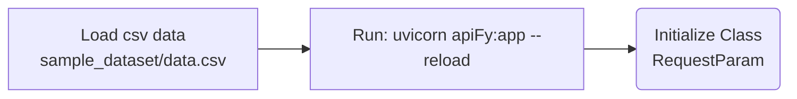

# APIFY-Go 🚀

APIFY-Go allows you to deploy custom Python scripts built with FastAPI, instantly turning your specific JSON datasets into live APIs. This approach provides a flexible, serverless backend that accelerates prototyping by letting you define complex data structures and endpoints directly in code.

---

### APIFY-Go features
1. High-Performance Asynchronous Framework: Built for speed, handles requests efficiently, making it ideal for serving data quickly in a cloud environment.
2. You can easily integrate Apify's Dataset storage to save and retrieve your JSON dictionaries across different API requests.
3. Handles API requests quickly and efficiently.
4. Apify-go runs everything for you; you just focus on your code.
5. Automatically creates a web page to test your API.

### Usage
```bash
git clone https://github.com/mhennn/APIFY-Go
```

### API Documentation
```bash
https://documenter.getpostman.com/view/51479109/2sBXcHieYq
```

### Data Structural Application
1. Change your dataset
```bash
utils/data.py
```
2. Test the program
```bash
uvicorn apiFy:app --reload
```

### Getting of Data
```bash
def request_simple_data(self):
    return self.reqs_data.simple_data()

def request_key_value(self, params=None):
    return self.reqs_data.key_value(params)
```

### Design Flow


### Ideal Usage
The program is design for simple dataset with no nested dict, but can be expanded.

### Testing the API
```bash
from request_module.request_params import RequestParam

def test_all():
    reqs = RequestParam("./sample_dataset/data.csv")
    data = reqs.request_simple_data()
    return data

def test_key():
    reqs = RequestParam("./sample_dataset/data.csv")
    data = reqs.request_key_value("Role")
    return data

print(test_key())
print(test_all())
```
##### Output Test
```bash
['Developer', 'Strategist', 'Analyst', 'Designer']

[{'Employee': 1001, 'ID': 'Alice', 'Name': 'Johnson', 'Department': 'Engineering', 'Project': 'Lead', 'Role': 'Developer', 'Hours': 40, 'Worked': None}, {'Employee': 1002, 'ID': 'Bob', 'Name': 'Smith', 'Department': 'Marketing', 'Project': 'Content', 'Role': 'Strategist', 'Hours': 25, 'Worked': None}, {'Employee': 1003, 'ID': 'Charlie', 'Name': 'Davis', 'Department': 'Engineering', 'Project': 'QA', 'Role': 'Analyst', 'Hours': 35, 'Worked': None}, {'Employee': 1004, 'ID': 'Diana', 'Name': 'Evans', 'Department': 'Design', 'Project': 'UI', 'Role': 'Designer', 'Hours': 30, 'Worked': None}]
```